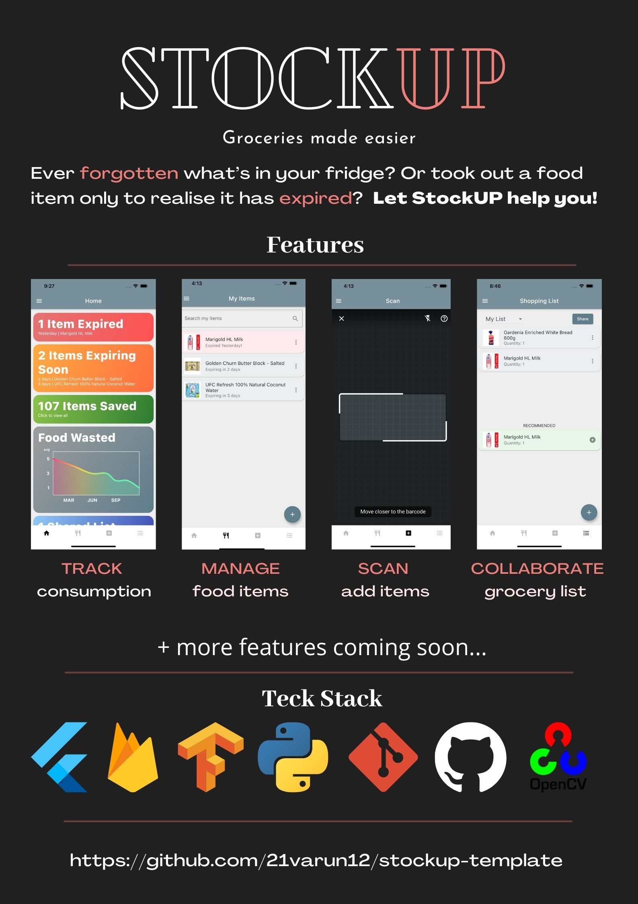

## Demo Video

Watch our demo [here](https://youtu.be/YbBfdvkQDQ8)

## Download Android App
Download the latest demo version of the Android app [here](https://github.com/stockup-studios/stockup/releases/download/v1.0-beta/StockUP-v1.0-beta.apk). We'll include some demo items for you to play around with.

## Features
<table>
  <colgroup>
       <col span="1" style="width: 25%;">
       <col span="1" style="width: 25%;">
       <col span="1" style="width: 25%;">
       <col span="1" style="width: 25%;">
  </colgroup>
  <tr>
    <th>Summary</th>
    <th>Manage</th>
    <th>Scan</th>
    <th>Collaborate</th>
  </tr>
  <tr>
    <td></td>
    <td></td>
    <td></td>
    <td></td>
  </tr> 
</table>

## Motivation
Ever forgotten what’s in your fridge? Or bought a food item only to realise it’s already in your fridge and now end up having too much? Most suggestions we get for this problem would be to buy less or remember to check the expiry date of food items frequently. But with the busy lives we all have, it is inevitable that some things just slip the mind.

So why not let a mobile app handle such mundane things for you and remind you what is about to expire? Better yet, keep track of your food wastage statistics using the same app and increase awareness of your eating habits as well!

## Aim
We hope to make grocery planning and keeping track of food at home easier through a mobile app that allows users to easily add, track and plan their food consumption patterns to reduce food wastage.
