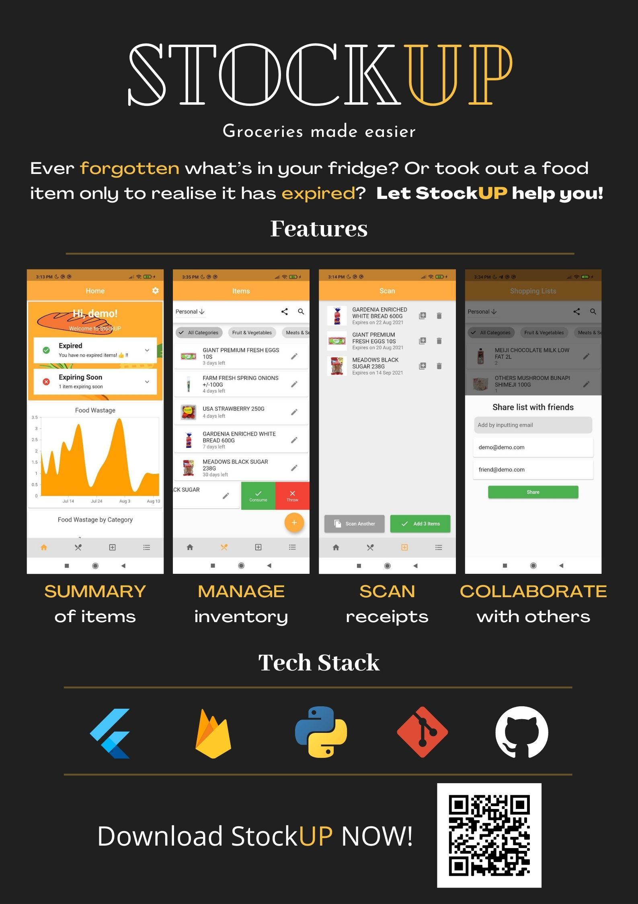

# Welcome to our StockUP App

Ever forgotten what’s in your fridge? Or bought a food item only to realise it’s already in your fridge and now end up having too much? Most suggestions we get for this problem would be to buy less or remember to check the expiry date of food items frequently. But with the busy lives we all have, it is inevitable that some things just slip the mind.

So why not let a mobile app handle such mundane things for you and remind you what is about to expire? Better yet, keep track of your food wastage statistics using the same app and increase awareness of your eating habits as well!

|Quick Overview |  Track and Manage Items | Scan New Items | Collaborative Grocery Lists |
:-------------------------:|:-------------------------:|:-------------------------:|:-------------------------:
|  |   |   |   |

## Aim

We hope to make grocery planning and keeping track of food at home easier through a mobile app that allows users to easily add, track and plan their food consumption patterns to reduce food wastage.

## User Stories

>*"I used to find it inconvenient to remember when food items I buy would **expire**. I always end up buying something and never getting the chance to even take a bite of it because the product expired. I want some way to keep track of when items I buy expire so I can plan my eating habits so I don’t cause **food wastage**."*

>*"I found it **difficult to collate** a list of items to buy from the rest of the household members whenever I go grocery shopping. I don’t like going back to the shop just to buy one item I missed."*

>*"I want to know how fast food runs out at home so I can **better plan when to buy food** so I don’t run out of food at home."*

>*"It would be **convenient to get recommendations** on what to add to my grocery list based on what I usually like and buy."*

# Features and Timeline

The **mobile application** built using Flutter provides 
* Scan receipt(s) using camera: OCR to identify each item in receipt from Giant
* Items sorted by days from expiry and filtered by categories as seen on Giant online
* Spline area chart on overall food wastage (food thrown or expired): so the user can keep track on their progress in cutting down food waste and what the trend is like over the period of time they have used StockUP
* Pie chart (doughnut chart) on food waste by category: to provide a quick analysis of expired food data for user and help user understand where the majority of food waste is in
* Collaborate with others to make a shopping list or item inventory list. Edit and use the list together with other users!
* Reminder of items expiring soon or expired on the home screen
* Simple swiping motions to manage shopping and inventory list items
* Searching of items in item or shopping list: no need to rummage through the cupboards for that box of spaghetti that may or may not be there

## Possible expansion:
Collaborate with local grocery outlets such as fairprice etc and even online grocery outlets to share e-receipt directly with the app
 
## Features to be completed by the mid of June:
 
* Mobile Application
Barcode scanner to scan product and return correct item with expiry date. Obtain training and testing data for expiry date recognition, training model

* Database 
Use web scrapers to collate and store the nutrition info on grocery items seen in Fairprice, Giant and Sheng Siong in Singapore

## Features to be completed by the mid of July:
 
* Data Visualisation features
  * Graphs on food item consumption
  * Calendar view of when items expire and reminder when expiry dates are close and 

* Mobile application
  * Scan items using camera and use computer vision to read the expiry date 
  * Integrate components for better app experience
          
* Collaborate with others to make a shopping list, with smart prediction using machine learning based on previously bought items

# Tech Stack
1. Flutter & Dart
2. Python
3. Firebase
4. Git & GitHub
5. Beautiful Soup
